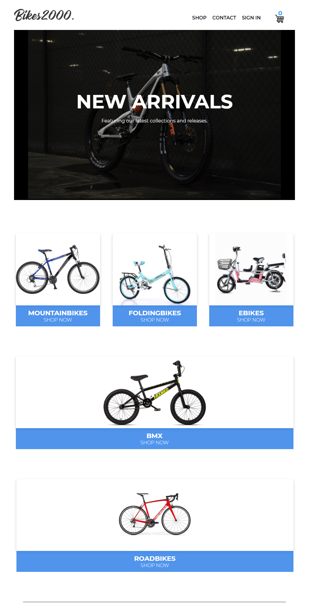

# Ecommerce Website
**Ecommerce Website with Live Stripe** integration ***Note***: "Stripe used For Viewing test data only to show hte payment is working inside the app."

 

# Project Status
This project is currently done, but still want to make some changes in future updates. **contacts** page only is currently not done. if you have any idea to make the app better, happy to work on that feature.

 

# Project Screen Shot(s)

 

# Functionality

An application used to add item, remove, sign in and sign out using google authentication and traditional sign up. you checkout item, make a payment using stripe, **provided**: "already the test key and card details in the app."  
 

**User** has a access of the site including the following:

* Sign in and Sin up using Google Authentication or Traditional Sign up.
* Add item and remove item on the cart
* Make a Payment using Stripe ``TestPayment``
* Choose on different category page.

 

# Tech Stack 
* Front End ``React`` , ``Sass``
* Back End  ``NodeJS`` , ``ExpressJS``, ``Firsbase``